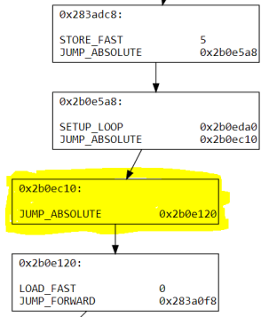
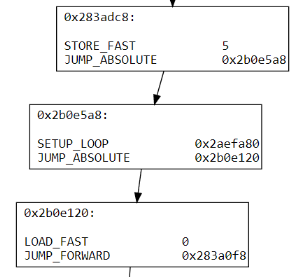
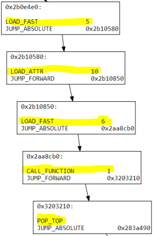
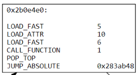

# Bytecode Simplifier

Bytecode simplifier is a tool to deobfuscate PjOrion protected python scripts. 
This is a complete rewrite of my older tool [PjOrion Deobfuscator](https://github.com/extremecoders-re/PjOrion-Deobfuscator)

## Pre-requisites

You need to have the following packages pre-installed:
- [networkx](http://networkx.github.io/)
- [pydotplus](http://pydotplus.readthedocs.io/)

Both of the packages are `pip` installable. Additionally, make sure graphviz executable is in your path for `pydotplus` to work.
`pydotplus` is required only for drawing graphs and if you do not want this feature you can comment out the `render_graph` calls in `deobfuscate` function in file [deobfuscator.py](deobfuscator.py)

## Statutory Warning 

PjOrion obfuscates the original file and introduces several wrapper layers on top of it. The purpose of these layers is simply to (sort of) decrypt the next inner layer and execute it via an `EXEC_STMT` instruction. Hence you CANNOT use this tool as-is on an obfuscated file. First, you would need to remove the wrapper layers and get hold of the actual obfuscated code object. Then you can marshal the obfuscated code to disk and run this tool on it which should hopefully give you back the deobfuscated code.

Refer to [this](https://0xec.blogspot.com/2017/07/deobfuscating-pjorion-using-bytecode.html) blog post for details.

## Implementation details

### Analysis

Bytecode simplifier analyzes obfuscated code using a recursive traversal disassembly approach. 
The instructions are disassembled and combined into basic blocks. A basic block is a sequence of instructions with a single entry and a single exit.

### Representation

A basic block may end with a control flow instruction such as an `if` statement. An `if` statement has two branches - true and false. 
Corresponding to the branches basic blocks have edges between them. This entire structure is represented by a [Directed Graph](https://en.wikipedia.org/wiki/Directed_graph).
We use [`networkx.DiGraph`](https://networkx.github.io/documentation/development/reference/classes.digraph.html) for this purpose.

The nodes in the graph represent the basic blocks whereas the edges between the nodes represent the control flow between the basic blocks.

A conditional control transfer instruction like `if` has two branches - the true branch which is executed when the condition holds. We tag this branch as the explicit edge as this branch is explicitly specified by the `if` statement. The other branch viz. the false one is tagged as an implicit edge, as it is logically deduced.

An unconditional control transfer instruction like `jump` has only an explicit edge.

### De-obfuscation

Once we have the code in a graph form it is easier to reason about the code. Hence simplification of the obfuscated code is done on this graph.

Two simplification strategies are principally used:
 - Forwarder elimination
 - Basic block merging

#### Forwarder elimination
A forwarder is a basic block that consists of a single unconditional control flow instructions. A forwarder transfers the execution to some other basic block without doing any useful work. 

**Before forwarder elimination**



The basic blocked highlighted in yellow is a forwarder block. It can be eliminated to give the following structure below.

**After forwarder elimination**



However, a forwarder cannot always be eliminated specifically in cases where the forwarder has implicit in-edges. Refer to [simplifier.py](simplifier.py) for the details

#### Basic block merging

A basic block can be merged onto its predecessor if and only if there is exactly one predecessor and the predecessor has this basic block as its lone successor.

**Before merging**



The highlighted instructions of the basic blocks have been merged to form a bigger basic block shown below. Control transfer instructions have been removed as they are not needed anymore.

**After merging**




### Assembly 

Once the graph has been simplified, we need to assemble the basic blocks back into flat code. This is implemented in the file [assembler.py](assembler.py). 

The assembly process in itself consists of sub-stages:

1. **DFS**: Do a depth-first search of the graph to determine the order of the basic blocks when they are laid out sequentially. (This is done in a post-order fashion)
2. **Removal of redundant jumps**: If basic block A has a jump instruction to block B, but block B is immediately located after A,  then the jump instruction can safely be removed. This feature is ***experimental*** and is known to break decompilers. However, the functionality of code is not affected. The advantage of this feature is it reduces code size. This feature is disabled by default.
3. **Changing `JUMP_FORWARD` to `JUMP_ABSOLUTE`**: If basic block A has a relative control flow instruction to block B, then block B must be located after block A in the generated layout. This is because relative control flow instructions are USUALLY used to refer to addresses located after it. If the relative c.f. instruction is `JUMP_FORWARD` we can change to `JUMP_ABSOLUTE`.
4. **Re-introducing forwarder blocks** : For other relative c.f instructions like `SETUP_LOOP,` `SETUP_EXCEPT` etc, we need to create a new forwarder block consisting of an absolute jump instruction to block B, and make the relative control flow instruction in block A to point to the forwarder block. This works since the forwarder block will naturally be after block A in the generated layout and relative instructions can be always used to point to blocks located after it, i.e. have a higher address.
5. **Calculation of block addresses**: Once the layouts of the blocks are fixed, we need to calculate the address of each block.
6. **Calculation of instruction operands**: Instructions like `JUMP_FORWARD` & `SETUP_LOOP` uses the operand to refer to other instructions. This reference is an integer denoting the offset/absolute address of the target.
7. **Emitting code**: This is the final code generation phase where the instructions are converted to their binary representations.

## Example usage

```
$ python main.py --ifile=obfuscated.pyc --ofile=deobfuscated.pyc

INFO:__main__:Opening file obfuscated.pyc
INFO:__main__:Input pyc file header matched
DEBUG:__main__:Unmarshalling file
INFO:__main__:Processing code object \x0b\x08\x0c\x19\x0b\x0e\x03
DEBUG:deobfuscator:Code entrypoint matched PjOrion signature v1
INFO:deobfuscator:Original code entrypoint at 124
INFO:deobfuscator:Starting control flow analysis...
DEBUG:disassembler:Finding leaders...
DEBUG:disassembler:Start leader at 124
DEBUG:disassembler:End leader at 127
.
<snip>
.
DEBUG:disassembler:Found 904 leaders
DEBUG:disassembler:Constructing basic blocks...
DEBUG:disassembler:Creating basic block 0x27dc5a8 spanning from 13 to 13, both inclusive
DEBUG:disassembler:Creating basic block 0x2837800 spanning from 5369 to 5370, end exclusive
.
<snip>
.
DEBUG:disassembler:461 basic blocks created
DEBUG:disassembler:Constructing edges between basic blocks...
DEBUG:disassembler:Adding explicit edge from block 0x2a98080 to 0x2aa88a0
DEBUG:disassembler:Adding explicit edge from block 0x2aa80f8 to 0x2a9ab70
DEBUG:disassembler:Basic block 0x2aa8dc8 has xreference
.
<snip>
.
INFO:deobfuscator:Control flow analysis completed.
INFO:deobfuscator:Starting simplication of basic blocks...
DEBUG:simplifier:Eliminating forwarders...
INFO:simplifier:Adding implicit edge from block 0x2aa8058 to 0x2a9ab70
INFO:simplifier:Adding explicit edge from block 0x2b07ee0 to 0x2a9ab70
DEBUG:simplifier:Forwarder basic block 0x2aa80f8 eliminated
.
<snip>
.
INFO:
INFO:simplifier:307 basic blocks merged.
INFO:deobfuscator:Simplication of basic blocks completed.
INFO:deobfuscator:Beginning verification of simplified basic block graph...
INFO:deobfuscator:Verification succeeded.
INFO:deobfuscator:Assembling basic blocks...
DEBUG:assembler:Performing a DFS on the graph to generate the layout of the blocks.
DEBUG:assembler:Morphing some JUMP_ABSOLUTE instructions to make file decompilable.
DEBUG:assembler:Verifying generated layout...
INFO:assembler:Basic block 0x2b0e940 uses a relative control transfer instruction to access block 0x2abb3a0 located before it.
INFO:assembler:Basic block 0x2ab5300 uses a relative control transfer instruction to access block 0x2ada918 located before it.
DEBUG:assembler:Successfully verified layout.
DEBUG:assembler:Calculating addresses of basic blocks.
DEBUG:assembler:Calculating instruction operands.
DEBUG:assembler:Generating code...
INFO:deobfuscator:Successfully assembled. 
INFO:__main__:Successfully deobfuscated code object main
INFO:__main__:Collecting constants for code object main
INFO:__main__:Generating new code object for main
INFO:__main__:Generating new code object for \x0b\x08\x0c\x19\x0b\x0e\x03
INFO:__main__:Writing deobfuscated code object to disk
INFO:__main__:Success
```
